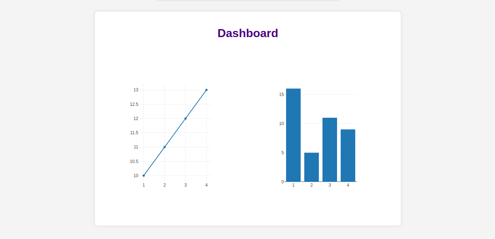
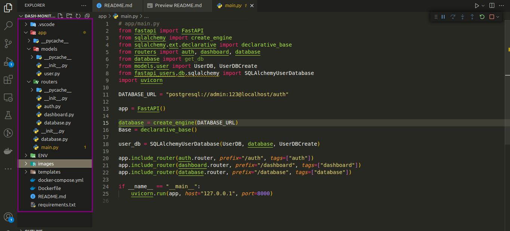

# Monitoramento de API usando FastAPI
- Ao desenvolver uma API, é crucial para o desenvolvedor verificar a saúde da mesma e realizar manutenções quando necessário, garantindo que a API entregue o que foi inicialmente projetado.



## Visão Geral
- Este projeto visa facilitar a verificação da saúde da API, proporcionando um gráfico intuitivo que informa ao desenvolvedor o estado atual da API de maneira rápida e fácil. Embora ferramentas como ```Postman``` e ```Insommia``` sejam úteis, a abordagem aqui busca fornecer uma solução integrada ao próprio projeto, simplificando o processo.


## Estrutura do projeto 
- O projeto é organizado em routers, onde cada rota possui uma classe única. Abaixo está um guia rápido sobre o que cada um desses módulos pode ajudar:




> app/models/user.py 
Este modelo estende as classes fornecidas pelo fastapi_users e adiciona colunas específicas ao banco de dados (usando SQLAlchemy) para name e age. Esses campos são opcionais e você pode ajustar conforme necessário.


> app/routers/auth.py
Este arquivo auth.py configura a autenticação, define rotas para login, protege rotas usando o JWTBearer, e gerencia a criação de usuários. Certifique-se de ter todas as importações corretas e que este arquivo está localizado em app/routers/auth.py.


> app/routers/auth.py
Este arquivo dashboard.py configura uma rota padrão que renderiza a página HTML do dashboard usando o Jinja2Templates. Certifique-se de ter todas as importações corretas e que este arquivo está localizado em app/routers/dashboard.py.


> app/routers/database.py
Este arquivo database.py configura uma rota para obter dados do banco de dados. Certifique-se de ter todas as importações corretas e que este arquivo está localizado em app/routers/database.py.


> app/database.py
Este arquivo database.py configura a conexão com o banco de dados usando SQLAlchemy. Certifique-se de ter todas as importações corretas e que este arquivo está localizado em app/database.py.